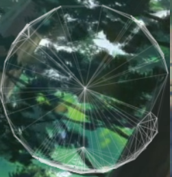
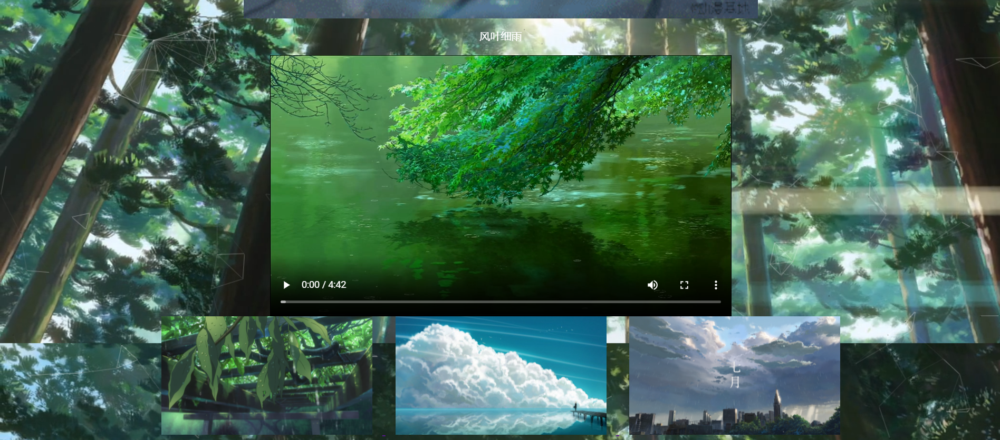
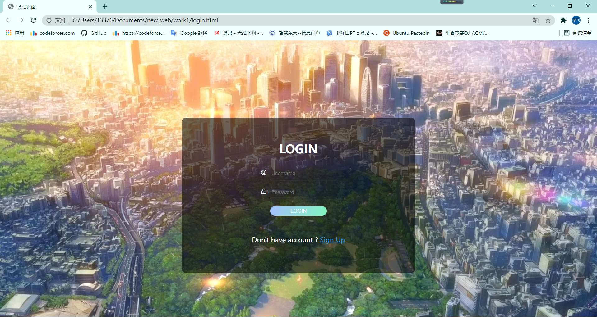

[TOC]
源代码链接:[视听](https://github.com/wxf-0415/wxf-0415.github.io)

# 作者

**伍孝飞 20194687 **

#整体构思

最开始设想是，构建一个动漫页面，有视频，链接，背景动态图播放。
由于后续需要引入js等操作，就增加了**个人登录页面**，就为后续的数据库等操作做好铺垫.

##元素构成

**背景粒子，隐藏彩蛋，音乐播放，表单获取，css调用，图片切换，图片播放，视频播放**
****
##第一页

###背景粒子渲染

采用$JavaScript$语言设计动态元素，捕捉鼠标悬浮等。

***
###整体的居中布局

$布局采用居中，放置一个色彩和背景图片相似的比较柔和的图片$
$下面放置，三张图片做为超链接，第一个链接是百度百科，第二个是相册自动播放，第三个是login.html，也就是为后续数据库准备的个人网页链接$
***
##第二页
###相册的建立，初步设想为图片自动播放

总共有4页图片，目前设定的是3秒循环播放，中间缺少切换过程，导致界面切换没有缓冲，**后续进行优化**，采用$JavaScript$进行循环播放
***
##第三页
###个人网页登陆界面的创建

页面采用的**icon图标**辅助设计。$LOGIN$按钮是作为$button$处理，连接到$function$函数，由于后续设计还没有想好，就先留着按钮作为触发。能够实现登录，但是登录的链接其他界面并没有实现

#### 数据库

使用的$jdbc$链接的$postgre$实现的粗略链接,简单查询，插入即可。

***

##彩蛋

在**第三页**中
| 账户名 | 密码 |
| :-----| ----: |
| music1 | admin |
后台自动播放音乐.
***
## 第四页

### 音乐播放器

**构建了一个音乐播放器**

### 功能

1.   具有切歌选项，内置了5首歌

2.   具有音乐大小拖拽表单，能够拖过拖拽增大或者减小声音

### 实现原理

使用$js$方法进行点击触发，又使用CSS进行样式变换,icon图标的插入以及布局。

